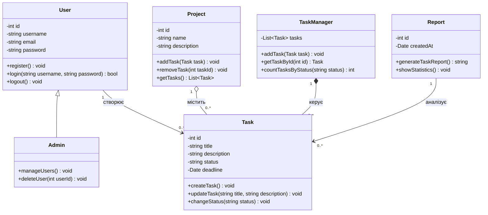

# Діаграма класів

```mermaid
classDiagram
    class User {
        -int id
        -string username
        -string email
        -string password
        +register() void
        +login(string username, string password) bool
        +logout() void
    }

    class Admin {
        +manageUsers() void
        +deleteUser(int userId) void
    }

    class Task {
        -int id
        -string title
        -string description
        -string status
        -Date deadline
        +createTask() void
        +updateTask(string title, string description) void
        +changeStatus(string status) void
    }

    class Project {
        -int id
        -string name
        -string description
        +addTask(Task task) void
        +removeTask(int taskId) void
        +getTasks() List~Task~
    }

    class TaskManager {
        -List~Task~ tasks
        +addTask(Task task) void
        +getTaskById(int id) Task
        +countTasksByStatus(string status) int
    }

    class Report {
        -int id
        -Date createdAt
        +generateTaskReport() string
        +showStatistics() void
    }

    User <|-- Admin
    User "1" --> "0..*" Task : створює
    Project "1" o-- "0..*" Task : містить
    TaskManager "1" *-- "0..*" Task : керує
    Report "1" --> "0..*" Task : аналізує
```
