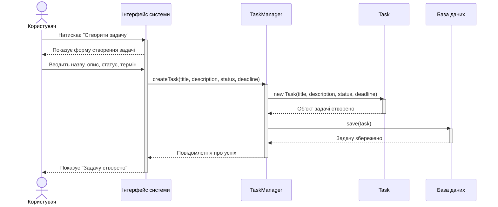

# Діаграма послідовності

```mermaid
sequenceDiagram
    actor User as Користувач
    participant UI as Інтерфейс системи
    participant Manager as TaskManager
    participant Task as Task
    participant DB as База даних

    User->>UI: Натискає "Створити задачу"
    activate UI

    UI-->>User: Показує форму створення задачі
    User->>UI: Вводить назву, опис, статус, термін

    UI->>Manager: createTask(title, description, status, deadline)
    activate Manager

    Manager->>Task: new Task(title, description, status, deadline)
    activate Task
    Task-->>Manager: Об'єкт задачі створено
    deactivate Task

    Manager->>DB: save(task)
    activate DB
    DB-->>Manager: Задачу збережено
    deactivate DB

    Manager-->>UI: Повідомлення про успіх
    deactivate Manager

    UI-->>User: Показує "Задачу створено"
    deactivate UI
```
