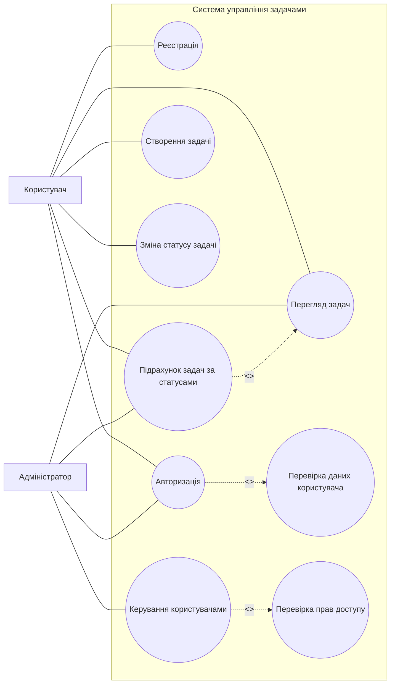

# Діаграма прецедентів

```mermaid
flowchart LR
    User[Користувач]
    Admin[Адміністратор]

    subgraph System[Система управління задачами]
        UC1((Реєстрація))
        UC2((Авторизація))
        UC3((Створення задачі))
        UC4((Перегляд задач))
        UC5((Зміна статусу задачі))
        UC6((Керування користувачами))
        UC7((Підрахунок задач за статусами))
        UC8((Перевірка даних користувача))
        UC9((Перевірка прав доступу))
    end

    User --- UC1
    User --- UC2
    User --- UC3
    User --- UC4
    User --- UC5
    User --- UC7

    Admin --- UC2
    Admin --- UC4
    Admin --- UC6
    Admin --- UC7

    UC2 -. "<<include>>" .-> UC8
    UC6 -. "<<include>>" .-> UC9
    UC7 -. "<<extend>>" .-> UC4
```
